<p align="center">

</p>

## Presentación del problema
Una empresa líder en el sector retail busca revolucionar su estrategia de desarrollo y entrega de software mediante la adopción de un modelo DevOps. El objetivo es reducir el tiempo de llegada al mercado y mejorar la calidad del software desarrollado internamente.

Para lograr esto, se ha establecido un equipo multidisciplinario encargado de liderar este proceso de modernización en las áreas de desarrollo, calidad y operaciones. La empresa también está interesada en explorar soluciones de automatización y escalabilidad para optimizar el despliegue de sus aplicaciones. Entre las responsabilidades del equipo se encuentran la evaluación de herramientas adecuadas, así como la implementación y documentación detallada del proyecto.

## Objetivos
El objetivo de este proyecto es establecer un proceso continuo de desarrollo e implementación (CI/CD) para una aplicación frontend y cuatro aplicaciones backend. Para lograrlo, el equipo utilizará un tablero Kanban para la planificación y seguimiento de las tareas. Se implementarán ciclos de integración y entrega continua en los entornos de desarrollo (Dev), pruebas (Test) y producción (Prod) para cada una de las aplicaciones. Además, se llevarán a cabo pruebas sobre las aplicaciones backend y/o la aplicación frontend seleccionada, que podrían incluir pruebas de carga y pruebas automatizadas utilizando herramientas como Postman y Selenium. Los resultados de estas pruebas se registrarán para evaluar el rendimiento de las aplicaciones.

Asimismo, se utilizará una herramienta de análisis de código estático en todas las aplicaciones del proyecto. Esta herramienta generará informes con los resultados del análisis de código, identificando posibles problemas y proponiendo mejoras para aumentar la calidad y seguridad del código fuente.

## Solución Propuesta
Nuestro enfoque implica la adopción de la metodología DevOps para optimizar tanto el desarrollo como la entrega de software. A través de una colaboración estrecha entre equipos y la automatización de procesos clave, nuestro objetivo es acelerar el tiempo de lanzamiento al mercado y asegurar la alta calidad del software. A continuación, se detallarán las modificaciones realizadas en cada una de las áreas involucradas.

### Tareas a realizar
Al comienzo del proyecto, hemos implementado un tablero Kanban para establecer una ruta detallada de las tareas necesarias y los plazos estimados para su ejecución.

Las tareas fueron las siguientes:
<p align="center">
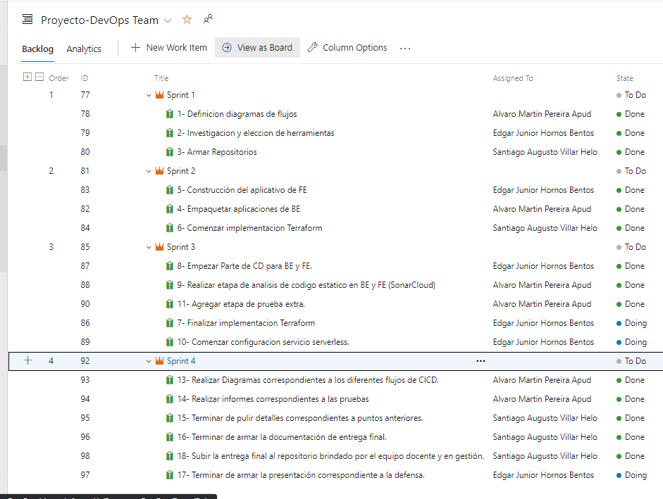
</p>

### Infraestructura 
En el área de la infraestructura, hemos llevado a cabo una transformación sustancial al adoptar un enfoque descentralizado mediante microservicios. Esta nueva arquitectura facilita una escalabilidad más ágil tanto en términos de capacidad como de rendimiento. Además, hemos migrado nuestra infraestructura a la nube, utilizando Terraform para implementar una gestión de infraestructura automatizada (IaC) en parte de los procesos requeridos, aprovechando los servicios de AWS para optimizar nuestros recursos tecnológicos.

### Manejo de repositorios y versionado
Para nuestra solución, hemos establecido dos tipos de repositorios. En primer lugar, creamos un repositorio dedicado a cada una de las aplicaciones. Por otro lado, hemos implementado un repositorio centralizado llamado DevOps. Este último se utiliza para almacenar todos los archivos relacionados con la infraestructura como código y los componentes necesarios para el ciclo de despliegue continuo.
- **Repositorios de aplicaciones:** En estos repositorios se almacena el desarrollo completo de cada microservicio, así como los archivos necesarios para la integración continua. Para gestionar el desarrollo y mantenimiento de cada aplicación, hemos adoptado el modelo de flujo de trabajo GitFlow. Este enfoque nos permite mantener un control detallado de cada versión del código. En cada repositorio, hemos establecido tres ramas estables: main, dev y test, que nos ayudan a gestionar eficientemente el ciclo de vida del software.

<p align="center">
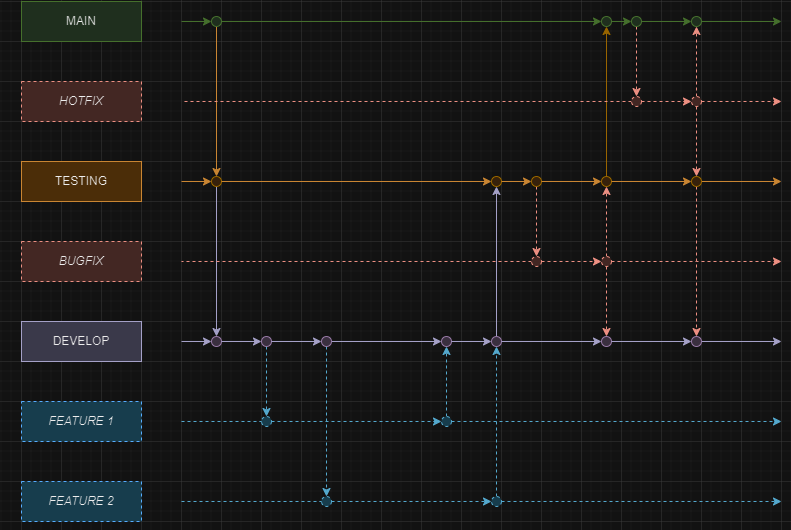
</p>

- **Repositorio DevOps:** En este repositorio se almacenan tanto los archivos que definen la infraestructura como código, así como aquellos relacionados con el ciclo de Continuous Deployment (CD). Para organizar el desarrollo, hemos adoptado la estrategia Trunk Based, que se caracteriza por mantener una única rama principal llamada 'main' para el código generado.
  
<p align="center">
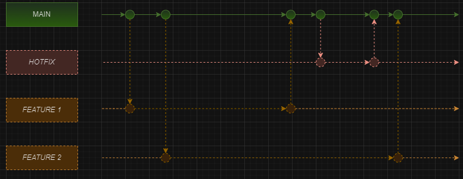
</p>

### Reglas de protección de las ramas 

Es importante señalar que, desde el comienzo del proyecto, implementamos una política rigurosa para proteger cada una de las ramas de las aplicaciones. Esta acción fue vital para monitorear todos los cambios realizados en las cuatro aplicaciones por los miembros del equipo.

Dicha política consistió en tres aspectos fundamentales:

1- El equipo de desarrollo solicito un "pull request" antes de fusionar cualquier cambio en el código. Esto garantizó que todas las modificaciones fueran revisadas y aprobadas por otro miembro del equipo antes de ser integradas en la rama principal.

2- Exigir que las ramas estuvieran actualizadas antes de proceder con una fusión. De esta forma, nos aseguramos de que el código estuviera alineado con la versión más reciente de la rama principal y evitamos posibles conflictos.

3- Aprovechando la integración con SonarCloud en cada uno de los repositorios, se ha añadido un requisito adicional al proceso de fusión. Antes de que cualquier miembro del equipo pueda fusionar sus cambios, debe esperar a que el análisis de código de SonarCloud sea satisfactorio y muestre un resultado positivo.

### Etapas de CI 
#### Análisis de código estático 

Para realizar el análisis estático del código y la revisión continua, hemos incorporado la herramienta SonarCloud en nuestros repositorios de GitHub. Este análisis se ejecuta automáticamente cada vez que se integra código en una de las ramas estables (main, dev, test) de nuestras aplicaciones.

Cuando se efectúa una modificación en el código y se inicia una pipeline, se puede observar cómo SonarCloud realiza la verificación del código. A continuación, presentamos una imagen que ilustra este proceso en acción:

<p align="center">
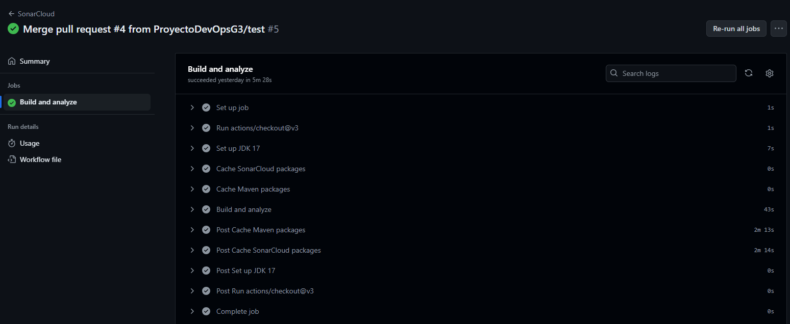 

#### Analisis de los resultados obtenidos y recomendaciones a implementar.

En general, la mayoría de los repositorios han arrojado resultados positivos, con un resultado final "passed". Sin embargo, es importante señalar que todos los repositorios han reportado algunos "code smells", que son indicativos de problemas o debilidades en el diseño o implementación del software. Estos code smells son importantes de tener en cuenta, ya que nos proporcionan información valiosa sobre áreas de mejora en el código.

##### Enfocandonos en cada uno de los repositorios 

Dentro de cada uno de los repositorios se encontraron los siguientes inconvenientes:

###### orders-service-example

<p align="center">
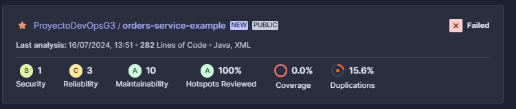
</p>

Seguridad: B (1 problema) <br>
Fiabilidad: C (3 problemas) <br>
Mantenibilidad: A (10 problemas) <br>
Hotspots Revisados: 100% <br>
Duplicaciones: 15.6% <br>
Resultado: Falló

Para resolver el Problema de seguridad, (Un NullPointerException), se podría verificar que la variable en uso no sea nula antes de aplicarla.


###### payments-service-example

<p align="center">
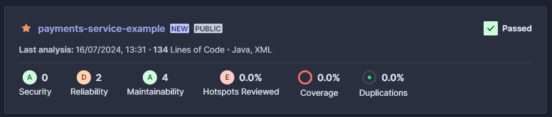
</p>

Seguridad: A (0 problemas) <br>
Fiabilidad: A (2 problemas) <br>
Mantenibilidad: A (4 problemas) <br>
Hotspots Revisados: 0.0%  <br>
Duplicaciones: 0.0% <br>
Resultado: Pasó 

No se destacaron problemas importantes a resolver por lo que el test quedo aprobado por la herramienta.

###### products-service-example

<p align="center">
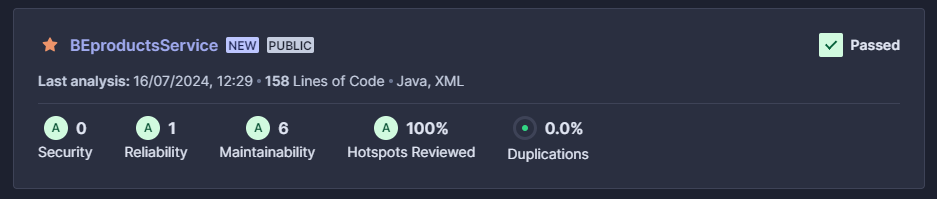
</p>

Seguridad: A (0 problemas) <br>
Fiabilidad: A (1 problema) <br>
Mantenibilidad: A (6 problemas) <br>
Hotspots Revisados: 100% <br>
Duplicaciones: 0.0% <br>
Resultado: Pasó 

No se destacaron problemas importantes a resolver por lo que el test quedo aprobado por la herramienta.

###### shipping-service-example

<p align="center">
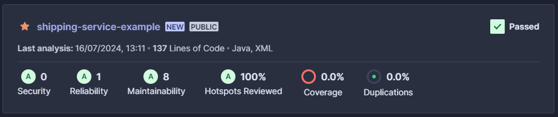
</p>

Seguridad: A (0 problemas) <br>
Fiabilidad: A (1 problema) <br>
Mantenibilidad: A (8 problemas) <br>
Hotspots Revisados: 100% <br>
Duplicaciones: 0.0% <br>
Resultado: Pasó

No se destacaron problemas importantes a resolver por lo que el test quedo aprobado por la herramienta.

###### FE

<p align="center">
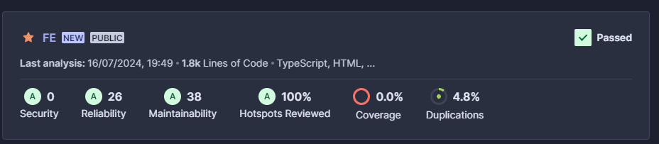
</p>

Seguridad: A (0 problemas)
Fiabilidad: A (26 problemas)
Mantenibilidad: A (38 problemas)
Hotspots Revisados: 100%
Duplicaciones: 4.8%
Resultado: Pasó

No se destacaron problemas importantes a resolver por lo que el test quedo aprobado por la herramienta.

###### Resultado general del analisis: 

###### Seguridad:

Todos los proyectos tienen una calificación de seguridad excelente (A) excepto orders-service-example, que tiene una calificación de seguridad de B.

###### Fiabilidad:

FE, payments-service-example, y shipping-service-example tienen una fiabilidad alta (A).
BEproductsService tiene una fiabilidad aceptable (A).
orders-service-example tiene una fiabilidad baja (C).

###### Mantenibilidad:

Todos los proyectos tienen una mantenibilidad alta (A), lo que sugiere que los problemas encontrados no son críticos y el código es fácil de mantener.

###### Hotspots Revisados:

Excepto payments-service-example, todos los proyectos tienen el 100% de los hotspots revisados.
Cobertura:

Todos los proyectos tienen 0% de cobertura, lo que indica que no se han ejecutado pruebas de cobertura o no se ha registrado cobertura alguna.

###### Duplicaciones:

BEproductsService, payments-service-example y shipping-service-example no tienen duplicaciones.
FE tiene un 4.8% de duplicación, y orders-service-example tiene un 15.6% de duplicación, lo cual es relativamente alto.

###### Resultado Final:

Todos los proyectos pasaron excepto orders-service-example, que falló debido a la alta duplicación de código y la baja fiabilidad.

###### Conclusión

En general, la mayoría de los repositorios muestran un buen estado en términos de seguridad, fiabilidad y mantenibilidad. Sin embargo, es crucial mejorar la cobertura de pruebas en todos los proyectos y abordar los problemas de duplicación especialmente en orders-service-example y FE.

Dejamos una imagen mostrando el dashboard completo del este Test:
<p align="center">
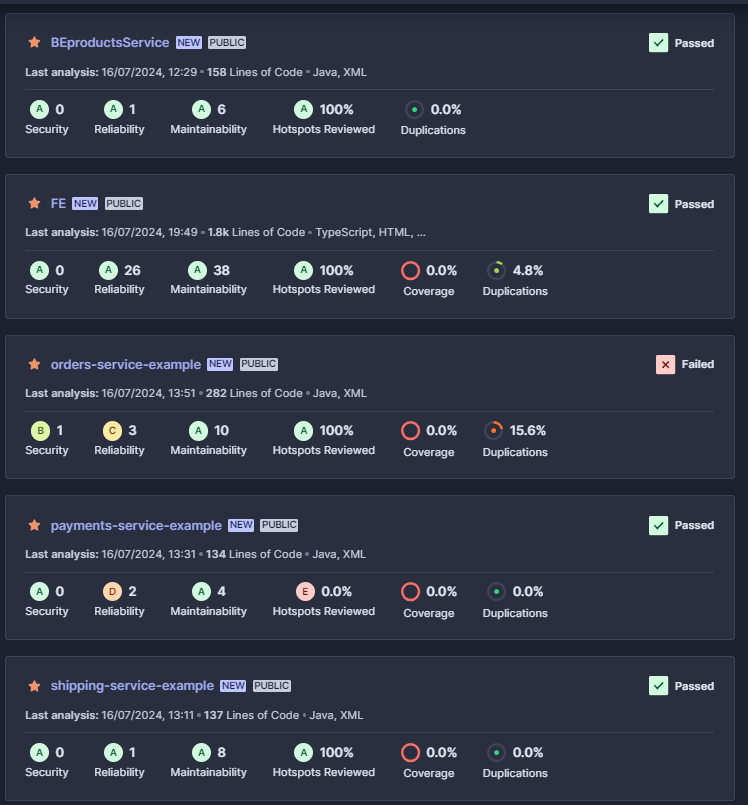
</p>

### Testing prueba extra Postman con Newman

Llevamos a cabo un exhaustivo proceso de pruebas para nuestra aplicación web utilizando Postman. Verificamos que el tiempo de respuesta fuera menor a 250 ms y que el código de estado fuera 200. También aseguramos que cada solicitud incluyera el tipo de contenido correcto en el encabezado. Además, realizamos una prueba de carga enviando 150 solicitudes con intervalos de 150 ms, de las cuales el 95% presentó tiempos de respuesta satisfactorios.

Link de Microservicio de productos donde se realizo la prueba: [http://18.209.15.56:8080/products]

El codigo implementado para el testeo dentro de la aplicación fue el siguiente:
```
function makeRequest() {
    pm.sendRequest(pm.request.url, (err, response) => {
        requestsCounter++;

        if (err) {
            console.log(`Error en la solicitud ${requestsCounter}: ${err}`);
        } else {
            console.log(`Solicitud ${requestsCounter}: Tiempo de respuesta ${response.responseTime} ms`);
            pm.expect(response.responseTime).to.be.below(250); 
        }

        if (requestsCounter === maxRequests) {
            clearInterval(intervalId);
        }
    });
}

const intervalId = setInterval(makeRequest, interval);

setTimeout(() => {
    console.log(`Se realizaron ${requestsCounter} solicitudes en ${testDuration} ms.`);
    pm.test("Prueba de carga finalizada", () => {
        pm.expect(requestsCounter).to.equal(maxRequests);
    });
}, testDuration)
```

A continuación dejamos la evidencia relacionada a dicho test:

<p align="center">
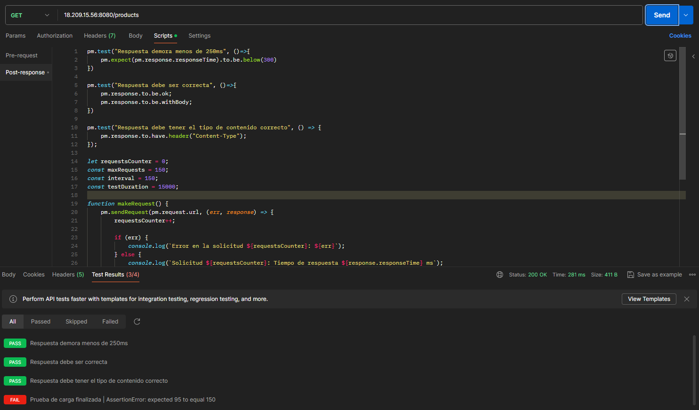
</p>
